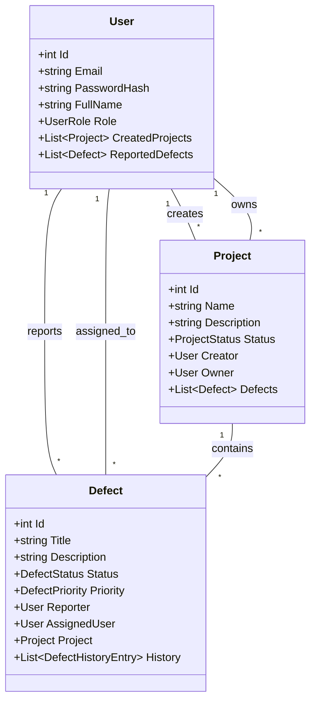

# OOOControlSystem - Defect management system at construction sites

## 📋 О проекте

OOOControlSystem - это монолитное веб-приложение для централизованного управления дефектами на строительных объектах. Система обеспечивает полный цикл работы: от регистрации дефекта и назначения исполнителя до контроля статусов и формирования отчётности для руководства.

### 👥 Целевая аудитория

- **Инженеры** - регистрация дефектов, обновление информации
- **Менеджеры** - назначение задач, контроль сроков, формирование отчетов
- **Руководители и заказчики** - просмотр прогресса и аналитической отчетности

## 🏗️ Архитектурный обзор

Проект реализован как монолитное веб-приложение с использованием .NET и Entity Framework. Архитектура разделена на следующие слои:

### Структура проекта

OOOControlSystem/
├── Controllers/           # MVC Контроллеры
│   ├── AuthController.cs
│   ├── UsersController.cs
│   ├── ProjectsController.cs
│   └── DefectsController.cs
├── Models/               # Модели данных
│   ├── User.cs
│   ├── Project.cs
│   ├── Defect.cs
│   └── Enums/
├── Services/             # Бизнес-логика
│   ├── AuthService.cs
│   └── TokenService.cs
├── Dtos/                 # Data Transfer Objects
├── Middleware/           # Промежуточное ПО
│   └── TokenValidationMiddleware.cs
├── ApplicationContext.cs # Контекст БД
├── appsettings.json      # Конфигурация подключений
└── Program.cs           # Конфигурация приложения

### Модели данных (`Models/`)
- `User` - пользователи системы с ролевой моделью
- `Project` - строительные проекты/объекты
- `Defect` - дефекты с историей изменений и вложениями

### Модели (Model Layer)

### Сервисы (`Services/`)
- `AuthService` - аутентификация и регистрация пользователей
- `TokenService` - генерация и валидация JWT-токенов

### Контроллеры (`Controllers/`)
- `AuthController` - endpoints для аутентификации
- `UsersController` - управление пользователями
- `ProjectsController` - управление проектами
- `DefectsController` - управление дефектами

### Middleware
- `TokenValidationMiddleware` - проверка валидности токенов через TokenVersion

## 🔐 Безопасность

- **Аутентификация** - JWT tokens с версионированием
- **Хранение паролей** - bcrypt хеширование
- **Ролевая модель** - строгое разграничение прав доступа

## 🛠️ Технологический стек

- **Backend**: .NET 8, Entity Framework Core, ASP.NET
- **База данных**: PostgreSQL
- **Аутентификация**: JWT Bearer
- **Безопасность**: bcrypt