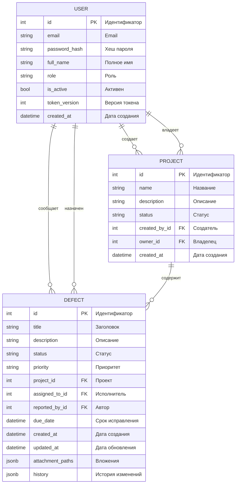

# OOOControlSystem - Defect management system at construction sites

[](https://dotnet.microsoft.com/)
[](https://learn.microsoft.com/dotnet/csharp/)
[](https://learn.microsoft.com/ef/)
[](https://jwt.io/)
[](https://www.postgresql.org/)
[](https://restfulapi.net/)

## 📋 О проекте

OOOControlSystem - это монолитное веб-приложение для централизованного управления дефектами на строительных объектах. Система обеспечивает полный цикл работы: от регистрации дефекта и назначения исполнителя до контроля статусов и формирования отчётности для руководства.

### 👥 Целевая аудитория

- **Инженеры** - регистрация дефектов, обновление информации
- **Менеджеры** - назначение задач, контроль сроков, формирование отчетов
- **Руководители и заказчики** - просмотр прогресса и аналитической отчетности

## 🏗️ Архитектурный обзор

Проект реализован как монолитное веб-приложение с использованием .NET и Entity Framework. Архитектура разделена на следующие слои:

### Структура проекта

```bash
OOOControlSystem/
├── 📂 Controllers/                 # MVC Контроллеры (API endpoints)
│   ├── 🔷 AuthController.cs        # Аутентификация и регистрация
│   ├── 🔷 UsersController.cs       # Управление пользователями
│   ├── 🔷 ProjectsController.cs    # Управление проектами
│   └── 🔷 DefectsController.cs     # Управление дефектами
│
├── 📂 Models/                      # Модели данных (Entity Framework)
│   ├── 🔷 User.cs                  # Сущность пользователя
│   ├── 🔷 Project.cs               # Сущность проекта
│   ├── 🔷 Defect.cs                # Сущность дефекта
│   └── 📂 Enums/                   # Перечисления
│       ├── 🔷 UserRole.cs          # Роли пользователей
│       ├── 🔷 ProjectStatus.cs     # Статусы проектов
│       ├── 🔷 DefectStatus.cs      # Статусы дефектов
│       └── 🔷 DefectPriority.cs    # Приоритеты дефектов
│
├── 📂 Services/                    # Бизнес-логика и сервисы
│   ├── 🔷 AuthService.cs           # Сервис аутентификации
│   └── 🔷 TokenService.cs          # Сервис работы с JWT-токенами
│
├── 📂 Dtos/                        # Data Transfer Objects
│   ├── 🔷 LoginDto.cs              # DTO для входа
│   ├── 🔷 RegisterDto.cs           # DTO для регистрации
│   ├── 🔷 UserUpdateDto.cs         # DTO для обновления пользователя
│   ├── 🔷 ProjectCreateDto.cs      # DTO для создания проекта
│   └── 🔷 ProjectUpdateDto.cs      # DTO для обновления проекта
│
├── 📂 Middleware/                  # Промежуточное ПО
│   └── 🔷 TokenValidationMiddleware.cs # Валидация JWT-токенов
│
├── 🔷 ApplicationContext.cs    # Контекст базы данных EF Core
│
├── 📜 Program.cs                   # Конфигурация приложения и DI
├── 📜 appsettings.json             # Конфигурационные параметры
├── 📜 OOOControlSystem.csproj      # Файл проекта
└── 📜 README.md                    # Документация проекта
```

### 📊 ER-диаграмма базы данных


## 🔐 Безопасность

- **Аутентификация** - JWT tokens с версионированием
- **Хранение паролей** - bcrypt хеширование
- **Ролевая модель** - строгое разграничение прав доступа

## 🛠️ Технологический стек

- **Backend**: .NET 8, Entity Framework Core, ASP.NET
- **База данных**: PostgreSQL
- **Аутентификация**: JWT Bearer
- **Безопасность**: bcrypt
